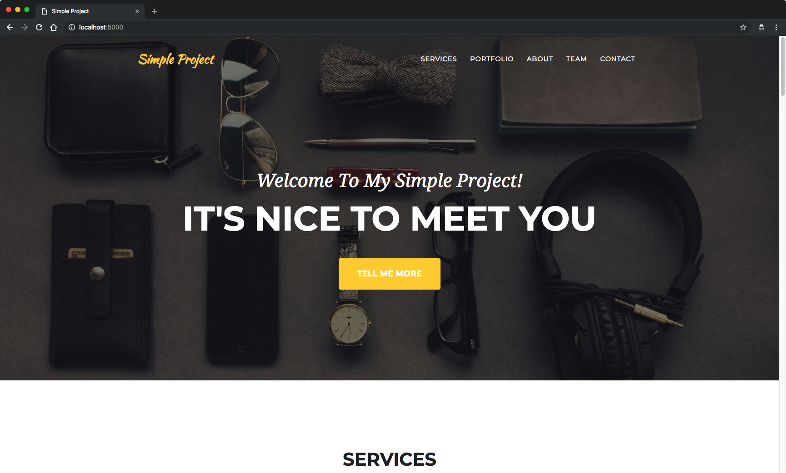

# Simple Project
 > This is a simple project to demonstrate how to build a simple Flask RESTful API with Docker-Compose.



## What is this project about?

This is the project that was used to create the tutorial on how to create a simpleFlask RESTful API with Docker-Compose.

You can find the tutorial on Medium by clicking [here].

## Requirements

To build this project you will need [Docker][Docker Install] and [Docker Compose][Docker Compose Install].

## Deploy and Run

After cloning this repository, you can type the following command to start the simple app:

```sh
make install
```

Then simply visit [localhost:5000][App] !


[Docker Install]:  https://docs.docker.com/install/
[Docker Compose Install]: https://docs.docker.com/compose/install/
[App]: http://127.0.0.1:5000
[here]: https://medium.com/@daniel.carlier/how-to-build-a-simple-flask-restful-api-with-docker-compose-2d849d738137
